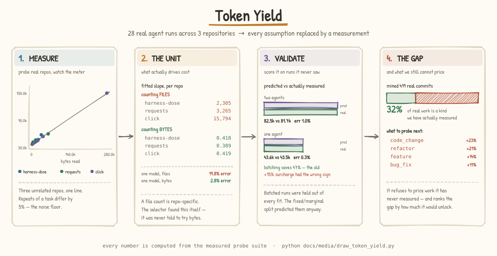

# HarnessDose — Token Yield

### Scope the project before you start: how many tokens, how many hours, how many dollars?

[](https://github.com/ginaecho/open-harness/actions/workflows/ci.yml)
[](https://zenodo.org/badge/latestdoi/1314056228)
[](LICENSE)

Run a handful of representative tasks for real. Measure what they actually cost.
Then **extrapolate to the project you haven't started yet** — a scaled variant, a
different mix, ten times the volume — and get a token budget with a confidence
interval instead of a guess.

> The Python package is `openharness`; **HarnessDose** is the project name — the
> *materia medica* framing where every rule is characterized like a dose you can
> measure. **Token Yield** (`token_yield/`) is the prediction layer built on top
> of that measurement.

---

## The idea in one picture



---

## The problem: nobody can price an agent project

A business project lands. Before you commit, someone has to answer: *what will
this cost, and how long will it take?* With agents, cost is tokens — and the
honest answer today is a shrug. So budgets get set by vibes, and the overrun is
discovered halfway through, when the money is already spent.

The reflex is to estimate each task and add them up. That is wrong twice over:
you are guessing at each task, **and** the sum is systematically low, because
combining task types costs more than running them in isolation.

## The move: measure a few, infer the rest

You don't need to predict every task. You need to **measure a small basis and
extrapolate**, the way you'd estimate a building from a few material costs.

**① Measure.** Run task type A, B, C for real. Record tokens, wall-clock, and
harness overhead per run. This is the only ground truth in the system, and it is
the part people skip.

**② Scale.** A harder variant of A is A times a multiplier. `A+` is 2×, `A++` is
4× *by default* — but the multiplier is per task type and meant to be
recalibrated from your own runs, not accepted as a law.

**③ Compose.** `A + B + C` is **not** the sum. Every additional distinct task
type in a project adds context switching, shared setup, and dependency chains.
Token Yield prices that explicitly as an interaction overhead instead of
pretending it away.

**④ Budget.** Out comes a token count, a dollar figure at your rate, an hour
estimate, and a 95% confidence interval propagated from the measured σ. The band
is wide when you have three samples and tightens as real runs land.

### The headline the sum-of-parts method hides

For the worked example in [`examples/token_yield_demo.py`](examples/token_yield_demo.py)
— 23 tasks across 5 types:

| | Tokens |
|---|---|
| Naive Σ of the parts | 769.2k |
| What it actually costs | **1.23M** |
| **Interaction surcharge** | **+60%** |

A budget built by summing per-task estimates would have been low by 60%. That
gap is the whole reason this exists.

---

## Quick start

```bash
pip install -e .          # no runtime dependencies; Python ≥ 3.9
python -m examples.token_yield_demo
```

That calibrates on 21 measured runs across 5 task types, prints the complexity
ladder, compares three project scenarios, and renders a full budget report.

```python
from token_yield import (
    CalibrationStore, CalibrationRecord, ComplexityTier,
    ProjectSpec, ProjectForecaster,
)

# ① measure — one record per real run you actually did
store = CalibrationStore()
for tt, runs in {
    "bug_fix": [(12_400, 180), (14_200, 210), (11_800, 165)],
    "feature": [(28_000, 420), (32_000, 480), (25_500, 390)],
    "docs":    [(4_500, 60), (5_000, 75), (4_200, 55)],
}.items():
    for tokens, seconds in runs:
        store.add(CalibrationRecord(tt, tokens, duration_seconds=seconds))

# ②–③ scope the project: task type × complexity × count
spec = (ProjectSpec("Q3 Platform Upgrade", interaction_overhead=0.15)
        .add("bug_fix", ComplexityTier.PLUS, count=8)
        .add("feature", ComplexityTier.PLUS, count=5)
        .add("docs",    ComplexityTier.BASE, count=5))

# ④ budget
budget = ProjectForecaster(store).forecast_with_cost(spec, dollars_per_million_tokens=3.0)
print(budget["total_tokens"], budget["estimated_cost"]["estimated"], budget["estimated_hours"])
#   666419  1.9993  2.74
```

Every task type you put in a spec must be one you have measured. If it isn't,
Token Yield **will not quietly leave it out of the total** — it names it in
`forecast.uncalibrated`, flips `forecast.is_complete` to `False`, and every
report prints an `INCOMPLETE BUDGET` block. A budget missing a third of the
project is worse than no budget at all.

Already running the harness layer? Skip the manual bookkeeping — a trace is
calibration data:

```python
store.from_observations(harness.trace)     # tokens + task_type are already there
```

---

## Architecture


Four stages, each a plain dataclass boundary you can test in isolation:

| Stage | Module | Turns | Into |
|-------|--------|-------|------|
| **Calibrate** | [`calibrate.py`](token_yield/calibrate.py) | measured runs, or a harness trace | `TaskTypeStats` — n, mean, σ, min, max, success rate |
| **Predict** | [`predict.py`](token_yield/predict.py) | stats × `ComplexityTier` | `TaskPrediction` — tokens, CI, duration |
| **Forecast** | [`forecast.py`](token_yield/forecast.py) | predictions × `ProjectSpec` | `ProjectForecast` — totals, overhead, CI |
| **Report** | [`report.py`](token_yield/report.py) | a forecast | text / Markdown / a plain dict |

Both figures are generated by
[`docs/media/draw_token_yield.py`](docs/media/draw_token_yield.py), which
**computes every number in them from the real engine** — so the pictures cannot
drift away from what the code predicts — and emits each glyph as an SVG path, so
they render identically for every reader with no font dependency. Regenerate
with `python docs/media/draw_token_yield.py`; the output is byte-identical.

## What Token Yield claims, and what it doesn't

Holding this to the same standard as the rest of the repo:

- **The demo's calibration data is synthetic.** It shows the mechanism, not a
  validated result. The engine is only as good as the runs you feed it, and
  nothing here has yet been validated against a real business project. Treat the
  worked example as a shape, not a benchmark.
- **The 2× / 4× multipliers are a starting hypothesis**, not a measured law.
  They are per-task-type and overridable
  (`TokenPredictor(store, custom_multipliers=...)`, or `custom_multiplier=` on a
  single call). Recalibrating them from your own `A+` runs is the point.
- **The interaction model is deliberately simple**: overhead scales linearly in
  the number of *distinct* task types, at a rate you set
  (`interaction_overhead`, default `0.15`). It is a knob you tune against
  outcomes, not a claim about how agents work.
- **The confidence interval is honest about ignorance.** It is propagated from
  the measured σ; below two samples it degrades to ±50% rather than inventing
  precision.

---

## The measurement layer underneath

Token Yield needs per-task token counts to calibrate on. That is exactly what
the harness layer already produces — and it is the rest of this repository.

### Your harness is a black box

Everyone who works seriously with agents builds a *harness* — the behavioral
rules that make the agent actually good: how it should write, how it should
develop code, how it should touch sensitive data. Your harness is deeply
personal and project-specific: you tune it yourself, through months of trial and
error.

But you're tuning blind. This craft knowledge lives *inside* the agent's skills
and prompt files, mixed in with everything else — you can't easily point at any
one rule, so testing whether it helps means designing a bespoke evaluation,
running the task with and without it, and reading the traces by hand, every
single time. And when and how these rules get used? Mostly, you let the agent
decide, based on a title. Then that is not a harness at all — it's a wish.

### Re-mount the rules as a layer above the agent

One architectural move: **take behavioral rules out of the agent's skills and
re-mount them as a plugin layer above the agent** — the way middleware sits above
application code, managed separately, tuned independently.

Each rule becomes a **harness module**: a small unit with a declared **scope**
(*binds when the agent modifies code*, *binds when a query touches PII*), a
**conformance check**, and a **price**. Binding is decided by the layer, not by
the agent's discretion. The agent underneath stays unchanged; the harness layer
watches and verifies from above.

That price tag is the bridge to Token Yield: because every check states its cost
in tokens, every session is already a calibration record.

- **Observable.** Once a module has boundaries, every activation is an event you
  can capture: *this happened → this module bound (with evidence) → the trace
  complied, or it didn't.* A stream of verdicts you watch in real time.
- **Testable.** A module is a unit with a scope and check defined once, so
  evaluation becomes *standing* instead of bespoke. Run the same task with the
  module on and off and measure the difference; record what each check costs
  (deterministic ≈ free, static ≈ cheap, LLM judge ≈ priced, with stated
  accuracy).

### The payoff: your harness cards dashboard

Accumulate that over real usage and every module earns a **harness card** — and
the cards form your dashboard. Each card answers, with numbers instead of
hunches:

- **What is it good at?** — competence per task type: `tdd` scores 92 on bug
  fixing but 38 on prototyping, so you know when to leave it off.
- **Is it being followed?** — passes, failures, and errors, split by severity.
- **What does it cost you?** — check tier, accuracy, and tokens per check.
- **Is it earning its place?** — a momentum trend across recent sessions.
- **What's happening upstream?** — new versions from the module's parent repo,
  impact analysis, conflicts with your other modules.

```bash
python -m examples.demo_session
```

Replays three sessions through five mounted modules, prints the verdict stream,
runs the A/B evaluations, and writes a self-contained **`dashboard.html`**.

```python
from openharness import Harness
from openharness.events import event, EventType
from modules import ALL

h = Harness(ALL)
h.observe(event(EventType.CODE_MODIFIED, task_id="t1", task_type="bug_fix"))
for o in h.trace:
    print(o.render_line())
#   [  1] code.modified    → tdd  ✗ fail (minor)  — code changed with no failing test written first
```

### What ships

Five starter modules spanning every tier and severity:

| Module | Binds when | Check tier | Severity |
|--------|------------|-----------|----------|
| `tdd` | code is modified | deterministic (free) | minor |
| `pii-guard` | a query touches a PII column | static | **critical** |
| `no-secrets` | a file is written | static | **critical** |
| `conventional-commits` | a commit is created | static | minor |
| `prose-style` | a document is written | LLM judge (priced, ~85%) | minor |

Each module is the behavioral rule **lifted out of a real skill** in
[`skills/`](skills) — `skills/bug-fix` → `tdd`, `skills/data-query` →
`pii-guard`. See [`docs/architecture.md`](docs/architecture.md) for the design
and [`modules/tdd.py`](modules/tdd.py) for the smallest complete example.

## Proving the harness layer works

"It works" is three separable claims — each proved differently. All reproducible
with `make prove` / `make test`; full write-up in
[`docs/proving-it-works.md`](docs/proving-it-works.md), step-by-step verification
in [`docs/how-it-was-tested.md`](docs/how-it-was-tested.md), and the honest
decomposition of *evaluating a harness without grading its own homework* in
[`docs/evaluation-methodology.md`](docs/evaluation-methodology.md) — which marks
every dataset synthetic vs real.

- **L1 — it *measures* correctly.** Every module scored as a violation
  classifier over a 38-trace labeled corpus with adversarial near-misses →
  **F1 = 1.00**, after the benchmark caught and we fixed two real `pii-guard`
  bugs (a leaked `ssn`, a false-flagged table name), now pinned as regressions.
- **L2 — enforcing it *improves outcomes*.** A/B ablation, 8 tasks × 30 seeds,
  same seeded decisions both arms: residual violations **50% → 0%** with **task
  success unchanged**, at ~4 retries/session. It even *measures* the
  `tdd`-on-prototype friction the cards claim.
- **L3 — it *plugs onto a real agent*.** A Claude Code `PostToolUse` hook turns
  live tool calls into events and streams verdicts. See
  [`integrations/`](integrations).
- **L5 — it fixes *ordering* failures.** [`precedence/`](precedence) reproduces
  a real four-mistake incident and shows **externalizing isn't the fix — the
  ordering is** (embedded 0/4 clean, externalized+bad-order 0/4,
  externalized+right-order **4/4**), with a FORGE-style static conflict scan. A
  **live-agent** run (16 isolated, memoryless opus subagents) crosses to
  efficacy: **25% → 0%** violations. See [`docs/precedence.md`](docs/precedence.md).

## Built on Microsoft's Agent Governance Toolkit

HarnessDose composes with Microsoft's
[Agent Governance Toolkit](https://github.com/microsoft/agent-governance-toolkit)
(AGT, MIT): **AGT enforces, HarnessDose characterizes and proves.** The four
lifted precedence rules compile into an AGT `PolicyDocument` and are enforced by
AGT's real `PolicyEvaluator` (`priority` = our precedence). AGT is an optional
dependency (`pip install agent-governance-toolkit-core`; `make agt`); the code
degrades gracefully when it's absent. Full mapping in
[`docs/agt-integration.md`](docs/agt-integration.md).

## Watch the story

A short walkthrough of the harness idea — why the harness is a black box, and
what lifting it into a plugin layer unlocks.

[](docs/media/OpenHarness_Story.mp4)

▶ **[Click for the full narrated video](docs/media/OpenHarness_Story.mp4)** (with audio).

## Layout

```
token_yield/     the prediction layer:  models · calibrate · predict · forecast · report
openharness/     the measurement layer:  module · events · harness · checks · trace · card · dashboard · evaluate · adapters · skills · govern · agt · cli
modules/         the starter materia medica (tdd, pii-guard, …)
skills/          real agent skills; each module is a rule lifted from one
benchmark/       L1 conformance + L2 ablation + reports/
precedence/      L5 — precedence/conflict layer, the A–D skill family, live-agent + AGT demos + reports/
integrations/    L3 — Claude Code hook + tool→event adapters
examples/        token_yield_demo.py (budget a project) · demo_session.py (writes dashboard.html)
tests/           pytest suite (83 tests: token yield, semantics, cards, benchmark, integration, precedence, AGT)
docs/            architecture · proving-it-works · how-it-was-tested · precedence · evaluation-methodology · agt-integration · zenodo
docs/media/      draw_token_yield.py — regenerates the hand-drawn figures from the real engine
```

## Citing & DOI

HarnessDose is set up for a citable [Zenodo](https://zenodo.org) DOI on every
release. The one-time owner consent step and the release flow are documented in
[`docs/zenodo.md`](docs/zenodo.md). Metadata lives in
[`CITATION.cff`](CITATION.cff) and [`.zenodo.json`](.zenodo.json).

## License

[MIT](LICENSE) © Gina Chen
