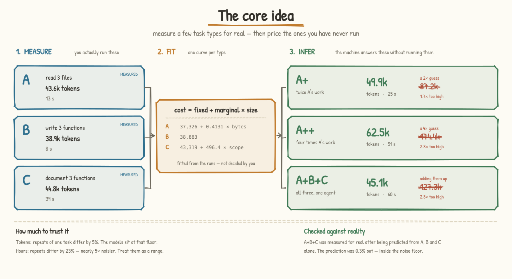
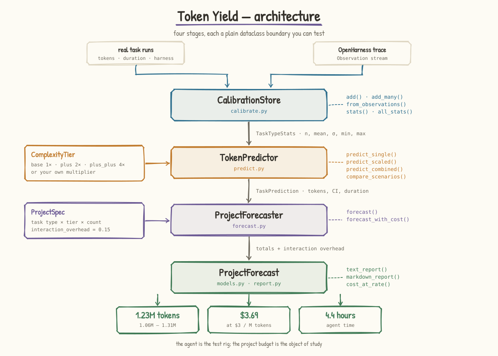

# HarnessDose — Token Yield

### Connect AI spend to accepted work — credible cost ranges at scoping, outlier risk priced in, and a chargeback line per task

[](https://github.com/ginaecho/open-harness/actions/workflows/ci.yml)
[](https://zenodo.org/badge/latestdoi/1314056228)
[](LICENSE)

**Budget the tokens before you spend them.** Token Yield is Lego-like
prediction for AI work: a small set of measured primitive bricks, and every
agentic workload built out of them. Run the bricks for real, record what each
*accepted deliverable* actually cost, fit a cost model — **letting the data
choose the model's shape, not just its coefficients** — then price the work you
haven't started yet as a credible range, with the expensive-outlier risk
located in the specific bricks that cause it. Every forecast itemises into
per-brick lines, which is exactly the shape budgeting, forecasting and
chargeback need.

> The Python package is `openharness`; **HarnessDose** is the project name — the
> *materia medica* framing where every rule is characterized like a dose you can
> measure. **Token Yield** (`token_yield/`) is the prediction layer built on top
> of that measurement.

---

## The core idea: Lego-like prediction

Name the primitive bricks an agent's work is made of. Measure each one for
real, keeping only runs that end in a checkable deliverable. Then price any
*stack* of them — including workloads nobody has ever run — by decomposing the
request into bricks and recomposing the cost.

The [animated explainer](docs/media/token-yield-explainer.html) (standalone
page — download and open) tells this in six steps. Each step is either measured
in this repository today or explicitly on the roadmap:

| the explainer | what it shows | measured here, today |
|---|---|---|
| **1 · Pre-simulation** — *"Take one primitive. Vary it. Measure it."* | one primitive perturbed: context removed, documents added, citations added | the Review ladder: the same instruction over 0.9→33 KB of real filings — **0.37 tokens/byte** over a **29.8k** agent start-up toll |
| **2 · Composition** — *"Stack primitives into real workloads."* | workloads bricked up; naive sum vs measured | 11 measured composites; batching into one agent beats one-agent-per-brick by **64–71%** |
| **3 · The second brick** — *"The same stack costs differently per industry."* | domain packs: healthcare ×1.8, finance ×1.5, energy ×1.3 | roadmap — to be **fitted as measured deltas** (re-run the campaign under each compliance overlay), never asserted as multipliers |
| **4 · Fit** — *"Train on every stack, in every domain."* | a cost model fitted across stacks and domains | six nested forms raced by leave-one-out CV; winner predicts at **2.55%** against a **0.29%** noise floor |
| **5 · A workload it has never seen** — *"Decompose. Recompose. Predict."* | an unseen healthcare copilot projected onto the bricks and rebuilt | held-out compositions at **2.2% mean error**; plain-English requests priced before running at **0–3.5%** |
| **6 · In the product** — *"adjust the workload, watch the budget move."* | the forecast UI, quoting tokens ±8% | `explain()` itemises every forecast — start-up, context, each brick at its measured marginal — the invoice line chargeback needs |

The measured slice uses nine **document-work bricks** — Review, Extract,
Classify, Retrieve, Reconcile, Draft, Remediate, Validate, Report — each a task
type enterprises already buy: invoice intake, contract review, financial close,
control testing, board reporting. The explainer's fuller registry adds the
**agent-mechanics bricks** (Plan, Tool call, MCP discovery, Generate, Loop
control, Eval harness, Prompt + memory); the registries are open, and fitted
per client. Same machinery, wider wall of bricks.


The full experiment — 39 measured agent runs over real SEC filings, the fitted
model, held-out accuracy and the limitations — is in
[docs/composition-findings.md](docs/composition-findings.md). Run it yourself
with `python -m examples.composition_demo`.

### From a token count to a budget line

The number a forecast produces is only useful to a budget holder in three
forms, and all three fall out of the same model:

- **A credible range, not a point.** Repeating the identical task varies runs
  by **0.29%**; the fitted model cross-validates at **2.55%** and predicts
  held-out compositions at **2.2% mean / 4.7% worst**. A forecast is therefore
  quoted as a range floored by that noise — never tighter than the process
  itself can repeat.
- **Outlier risk, priced and located.** The expensive tail is not uniform: it
  lives in the search-shaped work. `Retrieve` costs **5,384 tokens per unit** —
  an order of magnitude above every other primitive — because its cost is tool
  calls (one three-fact retrieval burned 36 of them and 47k tokens, the most
  expensive run in the campaign). Because the decomposition counts how much
  Retrieve a request contains, the range widens exactly where the risk is, and
  the mitigation is legible: narrow the search space before dispatching, batch
  everything else.
- **A chargeback line per brick.** `explain()` itemises every forecast — agent
  start-up, context bytes, then each brick at its measured marginal. The
  same decomposition that prices a request in advance becomes its invoice after
  the fact, so spend reconciles to accepted work items rather than to a blob of
  tokens.

### The second brick, concretely

A domain pack prices what an industry demands on top of the same stack: PHI
redaction, clinical ontology grounding and clinician sign-off for
**healthcare**; an audit trail per step, model-risk controls and cite-the-filing
for **finance**; telemetry windows and safety interlock checks for **energy**.
The explainer's multipliers (×1.8 / ×1.5 / ×1.3) are illustrative placeholders;
the point of this repository's method is that each pack becomes a *measured
delta* — the calibration campaign re-run under the overlay — so the industry
premium is a finding, not an assumption.

> *A small set of bricks. Any AI project, costed.*

### Where this came from

The earlier version of the idea, in terms of abstract task types `A`, `B`
and `C`:



The naive move is to scale: twice the work, twice the cost. Measurement says
otherwise, because a large fixed cost is paid once per agent invocation
whatever the task:

| you ask for | naive guess | what the fitted curve says | |
|---|---|---|---|
| **A+** — twice `A`'s work | 87.2k | **49.9k** | guess 1.7× too high |
| **A++** — four times `A`'s work | 174.4k | **62.5k** | guess 2.8× too high |
| **A+B+C** — all three, one agent | 127.3k | **45.1k** | guess 2.8× too high |

`A+B+C` was then **measured for real** after being predicted from `A`, `B` and
`C` alone. The prediction was **0.3% out** — inside the 5% noise floor. That
one number is the whole claim: a handful of measured task types really can
price the work you have not done yet.

Hours come out of the same machinery, and carry a bigger warning: repeat an
identical task and tokens vary by ~5% but wall-clock by ~23%. Time is
predicted, and reported as the wider range it honestly is.

---

## What that took to establish


---

## The problem: nobody can price an agent project

A business project lands. Before you commit, someone has to answer: *what will
this cost, and how long will it take?* With agents, cost is tokens — and the
honest answer today is a shrug. So budgets get set by vibes, and the overrun is
discovered halfway through, when the money is already spent.

The first version of this package answered that with **asserted constants**: a
harder task cost 2×, a much harder one 4×, and mixing task types added a 15%
interaction surcharge. Those numbers were never measured. They were typed in.

So we measured them.

## What the measurements said

28 real subagent runs across **three unrelated repositories** — this one,
`psf/requests` and `pallets/click` — at graded scope, with replicates. Every
constant the first version asserted turned out to be wrong, one of them
backwards, and the *unit of measurement* was wrong too.

| Asserted | Measured | Verdict |
|---|---|---|
| `A+ = 2×`, `A++ = 4×` — cost scales with work | 8× the scope moved tokens **1.39×** | wrong: a ~37k fixed cost dominates |
| Mixing task types adds **+15%** | Batching two kinds into one agent cost **53%** of running them separately | **wrong sign** — it is a 47% *saving* |
| Scope measured in **files** | Slope disagreed **7×** across repos (2,305 vs 3,265 vs 15,794 /file) | wrong unit — doesn't transfer |
| — | Same runs in **bytes**: 0.418 / 0.389 / 0.419 per byte | one model fits all three at **2.8%** |
| Confidence from sample-mean error | Repeating the identical task varies by **~5%** | that noise floor is the real limit |

The cross-repo probe is what caught the last one. At eight files read, the three
repos cost 57,732 · 59,851 · **149,655** tokens — same file count, because
click's eight files are 272 KB against requests' 60 KB. A hardcoded scope unit
would have hidden that exactly as the hardcoded multipliers hid the rest.

The fixed cost is the *agent boot* — system prompt, tool schemas, scaffolding —
paid once per invocation, before any of your work happens. Once you can see it,
both corrections follow: doubling the work does not double the tokens, and
combining work into one agent pays the boot cost once instead of twice.

## The move: fit the model, don't declare it

The fix is not better constants. It is refusing to have constants at all.

**① Measure.** [`probes.py`](token_yield/probes.py) defines self-contained tasks
at a stated *kind* and *scope*. Running one dispatches a fresh, memoryless
subagent and records what it actually spent. Graded scope is what makes a slope
estimable; replicates are what separate model error from run-to-run noise.

**② Fit.** [`costmodel.py`](token_yield/costmodel.py) fits four candidate shapes
— constant, proportional, affine, power — against every candidate *signal* the
records carry, and picks by leave-one-out cross-validation. **The data chooses
the shape and the explanatory variable**, not just the coefficients. Each kind
picked a different signal unprompted:

```
comprehension : 37,326 + 0.4131 × bytes    ← driven by what it reads
test_write    : 43,424 + 1,161  × scope    ← driven by what it writes
code_review   : 40,767 +     5  × scope    ← effectively flat
```

`proportional` — which *is* the old 1×/2×/4× rule — finishes last everywhere,
at 81% and 90% error.

**③ Validate.** [`backtest.py`](token_yield/backtest.py) scores the winner
against the **noise floor**: repeat a task and the counts still differ, so the
useful number is `skill = cross-validated error ÷ noise floor`. At `skill ≈ 1`
the model is as good as the process allows and more data will not help.

**④ Forecast, then learn.** [`plan.py`](token_yield/plan.py) prices a plan from
the fitted models, naming any kind it has no model for, any *signal* the plan
failed to supply, and any scope outside the fitted range. Then every finished
task comes back as a record — and that closes the loop.

### Knowing what you have not measured

[`mine.py`](token_yield/mine.py) reads a repository's history and classifies
each commit into a kind through transparent, evidence-carrying rules. Crossing
that against the kinds actually measured produces a **measurement backlog**:

```
Coverage: 32% of mined work is a kind we have measured
  probe 'code_change' → would cover a further 23%
  probe 'refactor'    → would cover a further 21%
  probe 'feature'     → would cover a further 14%
```

Over 419 commits from the three repos the real work is 24% docs, 23%
unclassifiable `code_change`, 21% refactor, 14% feature, 11% bug fix, 8% tests.
Acting on that backlog took coverage from **8% to 32%** in three probes. Mining
supplies the *what and how much*; only probes supply the *how expensive*.

### The loop is the point



[`learn.py`](token_yield/learn.py) scores each new run **against the standing
model before absorbing it**. That ordering is the whole discipline: once a
record is folded into a fit it can no longer surprise it, and a model that
silently absorbs contradicting data looks healthy forever.

```python
from token_yield import seeded_store, ScopedRecord, Provenance

store = seeded_store()                       # the shipped probe measurements
store.model_for("comprehension").equation()  # 'tokens = 37,326 + 0.4131 × bytes'

# a real run comes back far more expensive than predicted
report = store.observe(ScopedRecord("comprehension", 3, 88_000,
                                    signals={"bytes": 15_216},
                                    provenance=Provenance.PRODUCTION))
print(report.summary())
#   comprehension: 1 new records, MAPE 50.4%, bias +50.4%, 0% inside the
#   interval → refit: far from the new runs, consistently under-predicting by 50%
```

The model then refits — and may change *shape*, not merely slope.

## Quick start

```bash
pip install -e .                       # no runtime dependencies; Python ≥ 3.9
python -m examples.calibration_demo    # the measured findings and the loop
python -m examples.mining_demo         # mine repos, classify, see the gap
```

```python
from token_yield import seeded_store, WorkPlan, PlanForecaster

plan = (WorkPlan("Q3 audit")
        # comprehension is priced by bytes, so supply bytes
        .add("comprehension", scope=6, count=12, bytes=30_000)
        .add("code_write", scope=4, count=8))

fc = PlanForecaster(seeded_store()).forecast(plan)
print(fc.summary())
print(f"${fc.cost_at_rate(3.0):.2f}")
```

An unmeasured kind is **named, never dropped**; a signal the plan fails to
supply is **named too**, rather than silently read as zero; and a scope outside
the fitted range is **flagged as extrapolation** rather than quietly answered.

## What this claims, and what it doesn't

- **The measurements are real; the scope is small.** Eleven runs, two kinds,
  scope 1–8, one harness, one model, one repository. Every fitted model records
  the range it was fitted over. Predicting a 500-file refactor from these points
  would repeat exactly the error being corrected — so the code flags it instead.
- **The strongest claim is out-of-sample and pinned by a test.** The per-kind
  models were fitted only on single-kind runs. They predicted the held-out
  batching experiment to **3.8%**, inside the 5% noise floor, and
  `test_fitted_models_predict_the_unseen_composition_experiment` fails if that
  regresses.
- **`code_write` chose `constant`, which means scope carried no signal** over
  the range measured — not that writing code is free of scale effects. Its
  slope is real but small enough to be invisible under the boot cost here.
- **Duration does not track tokens.** Wall-clock varied far more than tokens
  across replicates, so hours are reported but are the least trustworthy output.
- **The tier-based API is still present** and still assumes its multipliers.
  It is kept for the worked budgeting example and marked throughout as the
  asserted path; the fitted path above is the one backed by measurement.

---

## The measurement layer underneath

Token Yield needs per-task token counts to calibrate on. That is exactly what
the harness layer already produces — and it is the rest of this repository.

### Your harness is a black box

Everyone who works seriously with agents builds a *harness* — the behavioral
rules that make the agent actually good: how it should write, how it should
develop code, how it should touch sensitive data. Your harness is deeply
personal and project-specific: you tune it yourself, through months of trial and
error.

But you're tuning blind. This craft knowledge lives *inside* the agent's skills
and prompt files, mixed in with everything else — you can't easily point at any
one rule, so testing whether it helps means designing a bespoke evaluation,
running the task with and without it, and reading the traces by hand, every
single time. And when and how these rules get used? Mostly, you let the agent
decide, based on a title. Then that is not a harness at all — it's a wish.

### Re-mount the rules as a layer above the agent

One architectural move: **take behavioral rules out of the agent's skills and
re-mount them as a plugin layer above the agent** — the way middleware sits above
application code, managed separately, tuned independently.

Each rule becomes a **harness module**: a small unit with a declared **scope**
(*binds when the agent modifies code*, *binds when a query touches PII*), a
**conformance check**, and a **price**. Binding is decided by the layer, not by
the agent's discretion. The agent underneath stays unchanged; the harness layer
watches and verifies from above.

That price tag is the bridge to Token Yield: because every check states its cost
in tokens, every session is already a calibration record.

- **Observable.** Once a module has boundaries, every activation is an event you
  can capture: *this happened → this module bound (with evidence) → the trace
  complied, or it didn't.* A stream of verdicts you watch in real time.
- **Testable.** A module is a unit with a scope and check defined once, so
  evaluation becomes *standing* instead of bespoke. Run the same task with the
  module on and off and measure the difference; record what each check costs
  (deterministic ≈ free, static ≈ cheap, LLM judge ≈ priced, with stated
  accuracy).

### The payoff: your harness cards dashboard

Accumulate that over real usage and every module earns a **harness card** — and
the cards form your dashboard. Each card answers, with numbers instead of
hunches:

- **What is it good at?** — competence per task type: `tdd` scores 92 on bug
  fixing but 38 on prototyping, so you know when to leave it off.
- **Is it being followed?** — passes, failures, and errors, split by severity.
- **What does it cost you?** — check tier, accuracy, and tokens per check.
- **Is it earning its place?** — a momentum trend across recent sessions.
- **What's happening upstream?** — new versions from the module's parent repo,
  impact analysis, conflicts with your other modules.

```bash
python -m examples.demo_session
```

Replays three sessions through five mounted modules, prints the verdict stream,
runs the A/B evaluations, and writes a self-contained **`dashboard.html`**.

```python
from openharness import Harness
from openharness.events import event, EventType
from modules import ALL

h = Harness(ALL)
h.observe(event(EventType.CODE_MODIFIED, task_id="t1", task_type="bug_fix"))
for o in h.trace:
    print(o.render_line())
#   [  1] code.modified    → tdd  ✗ fail (minor)  — code changed with no failing test written first
```

### What ships

Five starter modules spanning every tier and severity:

| Module | Binds when | Check tier | Severity |
|--------|------------|-----------|----------|
| `tdd` | code is modified | deterministic (free) | minor |
| `pii-guard` | a query touches a PII column | static | **critical** |
| `no-secrets` | a file is written | static | **critical** |
| `conventional-commits` | a commit is created | static | minor |
| `prose-style` | a document is written | LLM judge (priced, ~85%) | minor |

Each module is the behavioral rule **lifted out of a real skill** in
[`skills/`](skills) — `skills/bug-fix` → `tdd`, `skills/data-query` →
`pii-guard`. See [`docs/architecture.md`](docs/architecture.md) for the design
and [`modules/tdd.py`](modules/tdd.py) for the smallest complete example.

## Proving the harness layer works

"It works" is three separable claims — each proved differently. All reproducible
with `make prove` / `make test`; full write-up in
[`docs/proving-it-works.md`](docs/proving-it-works.md), step-by-step verification
in [`docs/how-it-was-tested.md`](docs/how-it-was-tested.md), and the honest
decomposition of *evaluating a harness without grading its own homework* in
[`docs/evaluation-methodology.md`](docs/evaluation-methodology.md) — which marks
every dataset synthetic vs real.

- **L1 — it *measures* correctly.** Every module scored as a violation
  classifier over a 38-trace labeled corpus with adversarial near-misses →
  **F1 = 1.00**, after the benchmark caught and we fixed two real `pii-guard`
  bugs (a leaked `ssn`, a false-flagged table name), now pinned as regressions.
- **L2 — enforcing it *improves outcomes*.** A/B ablation, 8 tasks × 30 seeds,
  same seeded decisions both arms: residual violations **50% → 0%** with **task
  success unchanged**, at ~4 retries/session. It even *measures* the
  `tdd`-on-prototype friction the cards claim.
- **L3 — it *plugs onto a real agent*.** A Claude Code `PostToolUse` hook turns
  live tool calls into events and streams verdicts. See
  [`integrations/`](integrations).
- **L5 — it fixes *ordering* failures.** [`precedence/`](precedence) reproduces
  a real four-mistake incident and shows **externalizing isn't the fix — the
  ordering is** (embedded 0/4 clean, externalized+bad-order 0/4,
  externalized+right-order **4/4**), with a FORGE-style static conflict scan. A
  **live-agent** run (16 isolated, memoryless opus subagents) crosses to
  efficacy: **25% → 0%** violations. See [`docs/precedence.md`](docs/precedence.md).

## Built on Microsoft's Agent Governance Toolkit

HarnessDose composes with Microsoft's
[Agent Governance Toolkit](https://github.com/microsoft/agent-governance-toolkit)
(AGT, MIT): **AGT enforces, HarnessDose characterizes and proves.** The four
lifted precedence rules compile into an AGT `PolicyDocument` and are enforced by
AGT's real `PolicyEvaluator` (`priority` = our precedence). AGT is an optional
dependency (`pip install agent-governance-toolkit-core`; `make agt`); the code
degrades gracefully when it's absent. Full mapping in
[`docs/agt-integration.md`](docs/agt-integration.md).

## Watch the story

A short walkthrough of the harness idea — why the harness is a black box, and
what lifting it into a plugin layer unlocks.

[](docs/media/OpenHarness_Story.mp4)

▶ **[Click for the full narrated video](docs/media/OpenHarness_Story.mp4)** (with audio).

## Layout

```
token_yield/     fitted layer:      taxonomy · costmodel · probes · learn · backtest · plan · mine · duration
                 asserted layer:    models · calibrate · predict · forecast · report
openharness/     the measurement layer:  module · events · harness · checks · trace · card · dashboard · evaluate · adapters · skills · govern · agt · cli
modules/         the starter materia medica (tdd, pii-guard, …)
skills/          real agent skills; each module is a rule lifted from one
benchmark/       L1 conformance + L2 ablation + reports/
precedence/      L5 — precedence/conflict layer, the A–D skill family, live-agent + AGT demos + reports/
integrations/    L3 — Claude Code hook + tool→event adapters
examples/        calibration_demo.py (measure → fit → validate → refit) · token_yield_demo.py · demo_session.py
tests/           pytest suite (186 tests: token yield, semantics, cards, benchmark, integration, precedence, AGT)
docs/            calibration-findings · composition-findings · architecture · proving-it-works · how-it-was-tested · precedence · evaluation-methodology · agt-integration · zenodo
docs/media/      draw_token_yield.py — regenerates the three hand-drawn figures from the real engine
```

## Citing & DOI

HarnessDose is set up for a citable [Zenodo](https://zenodo.org) DOI on every
release. The one-time owner consent step and the release flow are documented in
[`docs/zenodo.md`](docs/zenodo.md). Metadata lives in
[`CITATION.cff`](CITATION.cff) and [`.zenodo.json`](.zenodo.json).

## License

[MIT](LICENSE) © Gina Chen
