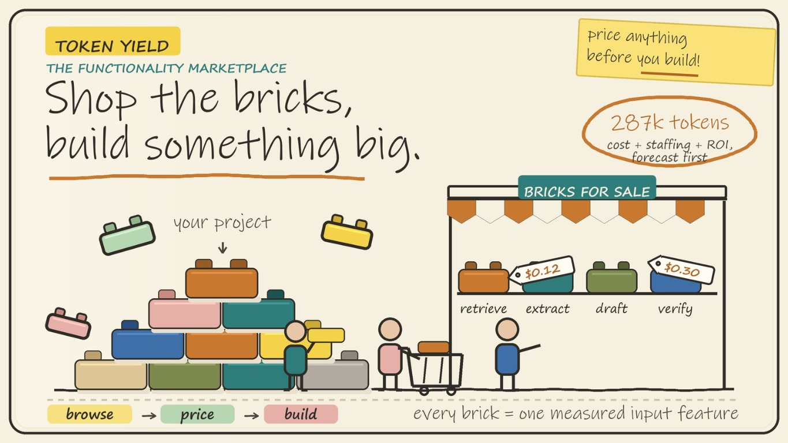
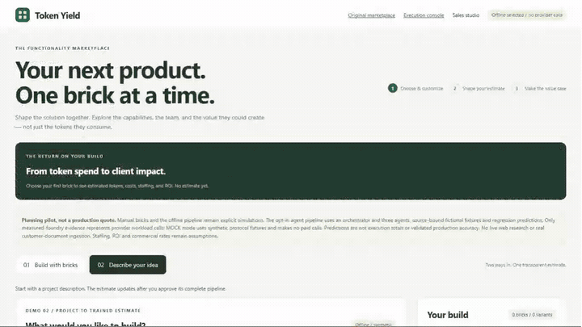

# 🧱 Token Yield Marketplace Studio

**Scope faster. Build with bricks. Win with AI value, not just AI cost.**

Clients buy better outcomes, not tokens. Token Yield turns a client brief into
reusable capabilities, a transparent scope, and an investment case with visible
assumptions. Predict AI consumption, compare cost and staffing scenarios, and
agree how business impact will be measured.

<p align="center">
  <a href="docs/media/Token_Yield_Studio_hack_video.mp4">
    
  </a>
</p>

## 🤖 The Foundry vision

[](https://github.com/ginaecho/lego-bricks-token-prediction/blob/main/docs/media/token-yield-foundry-marketplace-architecture.png)

The proposed architecture brings two hosted-agent layers into **Microsoft
Foundry on Azure**, supported by the Token Yield predictor:

* Brick agents deliver reusable work: Retrieve, Extract, Write, and Verify.
* Marketplace agents compose projects, govern execution, and propose
  improvements from reviewed feedback.
* The predictive model estimates token use and AI cost. Business benefits and
  wider delivery costs remain explicit assumptions.

**Fabric would connect the evidence to Power BI, Excel, Word, Teams, and
email:** project progress, expected outcomes, AI impact, and ROI. The goal is
one-click connection after permissions, connectors, and licensing are in place.
People approve scope, spending, and releases; code enforces access and budgets.

> [!NOTE]
> This is a target architecture, not a deployed cloud integration. Keep forecast,
> client-reported, and verified benefits separate. Bigger sales wins and client
> ROI remain goals to validate, not results established by token experiments.

Read the [short marketplace overview](https://github.com/ginaecho/lego-bricks-token-prediction/blob/main/docs/token-yield-learning-marketplace.md)
or explore the [current implementation](https://github.com/ginaecho/lego-bricks-token-prediction/blob/main/docs/architecture.md).

## 🎬 See it in action

### Token Yield Studio Live Demo

<p align="center">
  <a href="docs/media/Token_Yield_Live_Foundry_Demo.mp4">
    
  </a>
</p>

<p align="center">
  <strong><a href="docs/media/Token_Yield_Live_Foundry_Demo.mp4">Watch the Foundry Studio walkthrough (1:48)</a></strong>
</p>

Demo UI clicks select **Behavioral personalization**
and **Product comparison**, then change the first type to **Journey recommendations**.
Both builds immediately display trained composition token usage, cost and
assumption-based ROI. The walkthrough continues through
custom project input, the completed training stages, feature and holdout metrics,
the backend event console, and an actual PowerShell audit terminal. It uses
steady captures and one-second crossfades; the animation above previews the
opening Studio interaction.

The recording inspects **completed real Foundry evidence**, not a simulated
training animation or a new paid execution. Shopping and evidence inspection
make no provider calls. Run `dfcc835ac21643528f8a3d87b98b97cb` published the
generalizing model `5c5af9a0b7214756b35dc0915f9709e0` under the same approved
USD 25 campaign cap. All 16 individual types and all 240 ordered two-type
selections returned supported local forecasts; the 240-request check averaged
6.44 ms and peaked at 23.52 ms. This checks inference availability, not the
predictive accuracy of all 240 combinations.

| Measured run / displayed forecast | Result |
| --- | ---: |
| Latest iteration's provider responses | 8 fresh acceptance calls; original training rows re-audited and reused |
| Latest iteration's measured usage | 18,869 input + 7,599 output = 26,468 tokens |
| Calculated API cost of those calls | USD 0.1611575 |
| Conservative safety settlement for those calls | USD 1.89718 |
| Campaign safety spend, including failed/rejected attempts | USD 22.42620; no outstanding reservation |
| Model data split | 88 audited training rows + 8 fresh unseen-combination test rows |
| Held-out model error | 19.42 input / 141.35 output tokens MAE |
| Training MAPE / unseen-combination MAPE | Input 0.27% / 0.81%; output 5.38% / 15.31% |
| Training-mean baseline MAE | 616.30 input / 161.21 output tokens |
| Original exact pair | 1,503.69 tokens/run; USD 11.75 per 1,000 executions |
| Changed pair: Journey recommendations + Product comparison | 2,279.18 tokens/run; USD 15.22 per 1,000 executions |
| Changed pair's displayed 12-month ROI | 456.1%, from editable assumptions, not measured client returns |

The retail-rate calculation is not an Azure invoice. The larger safety amount
is conservative authorization accounting. Each source-only composition is
predicted directly and charged once; standalone forecasts are **not summed**. Fictional
documents supplied workload inputs; real provider usage supplied token labels.
The first generalizing candidate failed acceptance and was not published.
Its 16 holdout rows remained excluded; the next iteration selected the estimator
using training-only folds and passed unchanged gates on eight new combination
memberships. The broader custom-project quote retains its original agent
disagreement and missing-source limitations. This small accepted pilot
does not establish production accuracy, delivered customer value, or freedom
from overfitting.

### WHy and How

<p align="center">
  <a href="docs/media/Token_Yield_Studio_hack_video.mp4">
    
  </a>
  <a href="docs/media/Token_Yield_Explainer.mp4">
    
  </a>
</p>

<p align="center">
  <strong><a href="docs/media/Token_Yield_Studio_hack_video.mp4">Hackathon demo</a></strong>
  &nbsp;|&nbsp;
  <strong><a href="docs/media/Token_Yield_Explainer.mp4">Model explainer</a></strong>
  <br>
  Select either animation to open its full MP4 with playback controls.
</p>

## Learning from delivered projects

The [delivered-project feedback prototype](docs/customer-outcomes-prototype.md)
carries selected marketplace functionalities into a short client feedback form.
Submission updates candidate outcome predictors and an epsilon-greedy contextual
bandit. Protected evaluation and named human approval are required before a
learned policy changes future recommendations. The internal learning view shows
evidence-qualified brick rankings and requirement-constrained suggestions.

Actual token observations separately recalibrate the cost predictor. Experience
ratings, customer-reported finances, and verified business value are distinct:
synthetic demonstrations do not establish production ROI improvements, and this
is one-step policy learning, not foundation-model fine-tuning.

Run the local feedback service alongside the marketplace, without paid API calls:

```powershell
python -m examples.customer_outcomes_server --port 8793
```

Choose **Delivered project: give feedback** in the marketplace, or open
<http://127.0.0.1:8793>. The internal learning view is at
<http://127.0.0.1:8793/learning>; the reviewed-evidence studio is at `/admin`.
SQLite data persists locally in the git-ignored `.outcomes-prototype` directory.

## Quick start

The default demo runs entirely on your computer. It uses the offline simulation
and makes no Azure or paid model calls.

### 1. Install the prerequisites

You need:

* [Git](https://git-scm.com/downloads)
* [Python 3.9 or newer](https://www.python.org/downloads/)
* A modern web browser

Confirm Python is available:

```powershell
python --version
```

On Windows, use `py` instead of `python` if that is how Python is installed.

### 2. Clone and install

On Windows PowerShell:

```powershell
git clone https://github.com/ginaecho/lego-bricks-token-prediction.git
Set-Location lego-bricks-token-prediction
python -m venv .venv
.\.venv\Scripts\Activate.ps1
python -m pip install --upgrade pip
python -m pip install -e ".[dev]"
```

On macOS or Linux:

```bash
git clone https://github.com/ginaecho/lego-bricks-token-prediction.git
cd lego-bricks-token-prediction
python3 -m venv .venv
source .venv/bin/activate
python -m pip install --upgrade pip
python -m pip install -e ".[dev]"
```

### 3. Start the marketplace

```powershell
python -m examples.marketplace_demo_server --port 8765
```

Keep that terminal open, then visit:

<http://127.0.0.1:8765/marketplace-sales-demo.html?mode=custom>

In the studio:

1. Select **Load security project**.
2. Select **Start step-by-step + open operations**.
3. Use **Next step** to approve and run each stage.
4. Review the brick composition, token forecast, cost, staffing, and ROI view.

For two or more selected functions, the runtime creates one bounded ordered
workflow contract, measures that complete contract on grouped train and
holdout source sets, and predicts it directly. It never presents a sum of
standalone brick forecasts as the composition prediction. Unsupported or
oversized workflows abstain instead of falling back to illustrative totals.

In **Build with bricks**, open **Explore brick** to select variations and edit
monthly volume, setup hours, review effort, and tool fees in the same view.
Subtype meanings and clearly fictitious impact/value seeds appear alongside
staffing. These are
editable planning assumptions, not learned staffing predictions. Save the draft
under **Saved project** and send it to **Describe your idea** when ready.
Selection, editing, and saving never start provider calls or training.

With a compatible trained campaign loaded, choose **Behavioral personalization**
then **Product comparison** in the trained marketplace. Monthly workflow volume
is explicitly shared: editing it updates every selected type. The exact ordered composition is looked up locally and
priced once; component token/cost allocations are not invented. Editing a
brick preserves its position. Other combinations use the accepted generalizing
composition model through read-only `POST /api/forecast`; the request never
starts a paid job. The bounded protocol supports up to 40 ordered execution
steps. The editor rejects an oversized draft without replacing the current quote.
The default server loads the shipped, read-only measured model and catalog
from `examples/data/marketplace-trained`: shopping needs no Azure credentials
or retraining. Paid training remains disabled unless explicitly configured.
Preserve the approved campaign's state directory when restarting a paid Foundry
server; the shipped inference artifact is not a replacement budget ledger. **Describe your
idea** also lists persisted completed runs for read-only inspection after a
restart; opening one does not replay its execution. The completed-evidence link
brings the saved stages into view and preserves the run ID in the URL. Keep the
backend terminal open: saved-run URLs belong to that server's run directory,
not to every Studio instance.

The **marketplace-generalization** training scope prepares the Sales model
before shopping. It freezes 12 training combinations and eight membership-disjoint
acceptance combinations, each with two source instances and all 16 subtypes
represented in both sets. It reuses 64 audited singleton training labels, never
old holdout labels. New labels are actual GPT-5.4 usage; fictitious impact or ROI
seeds cannot enter token training. Every composed step has a required named
structured-output field, so omitted work cannot become a valid label.

The 20 input features cover seven operation counts, prompt/source bytes,
document count, component count, shared operations, handoffs, and seven
order-position features. Standardization and Ridge fitting use
training data only; four-fold combination-grouped validation selects raw versus
log targets and alpha. Parameters are written before fresh acceptance calls. Publication
requires input/output MAPE at most 15%/30%, every subtype at most 25%/45%,
and both MAEs at least 10% better than the composition-training-mean baseline.
Operations shows training error, unseen-combination error, generalization gaps,
and per-type gates. These are small-pilot checks, not proof of production accuracy
or absence of overfitting. A rejected model never replaces the accepted registry.
An iteration may set `training_parent_run` to re-audit and reuse the original
24 composition training rows. It excludes every earlier holdout membership,
freezes eight new acceptance combinations, and measures one fresh source
instance per combination under the same gates. This budget-bounded test has
less replication than the first attempt; no previous acceptance labels enter
training or model selection.
Usage estimates cannot exceed the configured 1,536-output-token provider cap.
When the raw regression exceeds it, the response retains the uncapped value,
flags the bounded estimate, and the Sales quote warns that completing every
step is not guaranteed near the ceiling. This is an explicit resource bound,
not a substitute training label or evidence of successful execution.

If port `8765` is busy, start the server with `--port 8766` and use the same
port in the browser URL. Press `Ctrl+C` in the terminal to stop the server.
Local run artifacts are written to `.demo-runs/`.

### 4. Run the measured prediction demo

The marketplace demonstrates the product experience. This command runs the
core LEGO-like token predictor against the committed measurement data:

```powershell
python -m examples.composition_demo
```

No credentials or external services are required.

### 5. Run the tests

```powershell
python -m pytest -q
```

## Videos

### Hackathon demo

[Watch Token Yield Marketplace Studio](docs/media/Token_Yield_Studio_hack_video.mp4)
to see the client request, agent workflow, human approval points, marketplace
quote, and business-value story.

### Model explainer

[Watch the Token Yield model explainer](docs/media/Token_Yield_Explainer.mp4)
to see how measured task bricks are combined, trained, and used to predict a
new workload.

## How it works

```text
Client request
    -> agents find and compose task bricks
    -> humans approve scope and assumptions
    -> the model predicts tokens; rates and assumptions give cost scenarios
    -> agents deliver the work
    -> actual usage recalibrates token forecasts
    -> reviewed quality and feedback inform candidate improvements
```

## What is a basic block?

A basic block describes one repeatable action inside an agentic project. The
names below are a business-friendly way to explain the idea:

| Basic block | Meaning in an agentic project | Current code mapping |
| --- | --- | --- |
| Search | Find relevant information in an authorized external source | `fetch` or `retrieve`; the live pilot is source-only and does not browse |
| Retrieve | Fetch specific information from a known source or knowledge base | `retrieve` |
| Extract | Pull structured information from documents or text | `extract` |
| Classify | Categorize, label, or route information | `classify` |
| Analyze | Reason over information to derive findings | A composition of `score`, `plan`, and `verify` |
| Generate | Produce text, code, recommendations, or other content | `write` |
| Evaluate | Assess an output against criteria | `score` and `verify` |
| Validate | Check correctness or compliance against explicit rules | `verify`; `validate` in the broader research catalog |
| Transform | Convert information from one representation to another | `transform` in the broader research catalog |
| Report | Present findings or results in a structured artifact | `write`; `report` in the customer-scoping model |

Token Yield does not force every experiment into one permanent list. Each
model artifact records the exact, versioned vocabulary it was trained on. The
live marketplace currently measures seven low-level atoms: `extract`,
`classify`, `score`, `plan`, `retrieve`, `verify`, and `write`. These combine
into customer-facing capabilities such as research, document review, support,
recommendations, and reporting.

The same decomposition supports the initial forecast, itemised quote, and
quote-to-actual reconciliation.

## What the experiments show

The core model was trained and evaluated with real, instrumented agent runs
instead of invented token counts.

| Measurement | Result |
| --- | ---: |
| Cross-validation on 35 measured agent runs | 2.55% average total-token error |
| Four brick combinations excluded from training | 2.2% average error |
| Three requests written in plain English | 0% to 3.5% error |
| Marketplace model on 20 calls from two held-back projects | 32.5 input-token and 35.2 output-token average error per call |

Read the [composition findings](docs/composition-findings.md), the
[plain-English training explanation](docs/lego-model-training.md), or the
[HTML results report](docs/customer-model-report.html) for the underlying
measurements and evaluation context.

## Explore the project

* [Marketplace vision and AI value](https://github.com/ginaecho/lego-bricks-token-prediction/blob/main/docs/token-yield-learning-marketplace.md)
* [Proposed Foundry architecture diagram](https://github.com/ginaecho/lego-bricks-token-prediction/blob/main/docs/media/token-yield-foundry-marketplace-architecture.png)
* [Marketplace prototype guide](docs/marketplace-prototype.md)
* [Marketplace model and quoting roadmap](docs/marketplace-models/plan.md)
* [Service selection and quoting guide](docs/marketplace-models/quoting.md)
* [Model training explanation](docs/lego-model-training.md)
* [Experiment and prediction results](docs/composition-findings.md)
* [Current system architecture](docs/architecture.md)
* [Agent and model testing workflow](docs/how-it-was-tested.md)

Live Azure Foundry execution is optional and requires explicit configuration,
authorization, and budget approval. Follow the
[real Foundry agent pilot instructions](docs/marketplace-prototype.md#real-foundry-agent-pilot)
instead of enabling paid execution from the quick start.

*Token Yield (`token_yield/`) stands on **HarnessDose**, the measurement layer
(package `openharness`), and composes with Microsoft's
[Agent Governance Toolkit](https://github.com/microsoft/agent-governance-toolkit).
`assay/` is the independent falsification harness that audits it, and
`assay/studio/` is its visual demo.
Docs: [calibration](docs/calibration-findings.md) ·
[architecture](docs/architecture.md) · [precedence](docs/precedence.md) ·
[AGT](docs/agt-integration.md) · [Zenodo/citing](docs/zenodo.md).*
