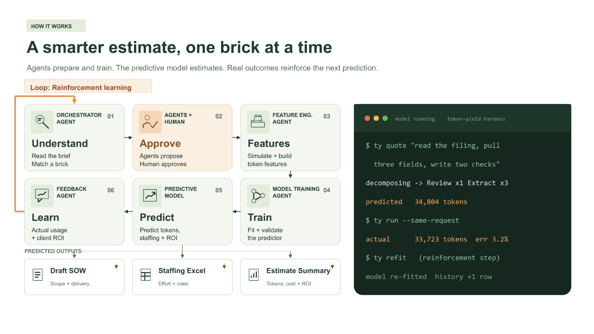

# Token Yield architecture

Token Yield is a human-governed marketplace and learning system for AI work.
It turns a project description into reusable task bricks, measures those bricks
with agents, trains a token predictor, and returns a transparent estimate of
cost, staffing, risk, and potential value.

The system is designed around one principle:

> Agents perform repeatable work. Humans approve consequential decisions.
> Measured outcomes improve the next prediction.



## System at a glance

```text
Sales Studio                 Local control plane
------------------------     ----------------------------------
Project request          ->  POST /api/runs
Scenario and assumptions ->  validated run contract
Human approvals          ->  one-time stage gates
Quote and ROI view       <-  run events and final artifacts
                                |
                                v
Agent and model pipeline
----------------------------------------------------------------
Understand -> Approve -> Build features -> Train -> Predict -> Learn
    |             |             |            |         |        |
catalog       human gate    measurements   model     quote    feedback
matching      and budget    and evidence   artifact  + SOW    + drift
```

The browser is a presentation and control surface. The Python backend owns the
workflow, validation, model fitting, evidence, budgets, and state.

## Main components

| Component | Responsibility | Main implementation |
| --- | --- | --- |
| Marketplace Sales Studio | Captures the project, shows the proposal, and presents cost, staffing, and ROI scenarios | `marketplace-sales-demo.html` |
| Operations Studio | Shows every stage, agent output, approval gate, model step, and final evidence | `marketplace-operations-demo.html` |
| Runtime terminal | Exposes model and pipeline events for a technical operator | `marketplace-console.html` |
| Local control plane | Serves the UI, validates requests, manages runs, and enforces stage controls | `examples/marketplace_demo_server.py` |
| Offline pipeline | Demonstrates decomposition, feature engineering, fitting, evaluation, and prediction without network calls | `token_yield/marketplace_demo.py` |
| Foundry agent runtime | Coordinates specialized agents and measured Azure AI Foundry calls | `token_yield/marketplace_agents.py` |
| Agent contracts | Defines roles, messages, brick atoms, schemas, and validation | `token_yield/marketplace_agent_contracts.py` |
| Brick and service catalog | Defines reusable tasks, versions, quantities, schemas, and quote-time features | `token_yield/tasks.py`, `token_yield/marketplace.py` |
| Prediction engine | Fits candidate models and predicts input tokens, output tokens, cost, and risk | `token_yield/robust.py`, `token_yield/marketplace_models.py` |
| Learning loop | Compares forecasts with later evidence, detects drift, and triggers governed refitting | `token_yield/learn.py`, `token_yield/measurement_policy.py` |
| Evidence store | Persists requests, events, model artifacts, measurements, hashes, and budget state | `.demo-runs/`, approved campaign state, `runs/` |

## End-to-end workflow

### 1. Understand the request

A client, pursuit lead, ISD lead, or project manager enters a project
description. The orchestrator validates the request and checks whether the
marketplace already contains the required capability.

The request can:

* Reuse an existing brick
* Combine several existing bricks
* Propose a genuinely new function
* Stop for clarification when the request is ambiguous

The system does not treat every new phrase as a new capability.

### 2. Decompose into versioned building blocks

The decomposition layer converts plain English into named, countable work.
Token Yield contains several deliberately separate vocabularies because they
belong to different experiments and model contracts:

| Vocabulary | Implemented blocks | Purpose |
| --- | --- | --- |
| Live agent marketplace | `extract`, `classify`, `score`, `plan`, `retrieve`, `verify`, `write` | The seven atoms used by the Foundry agent pipeline and its feature builders |
| Customer-scoping model | `extract`, `classify`, `plan`, `report` | The four operations measured for public-request scoping |
| Broader research catalog | Twenty primitives in `token_yield/tasks.py` | Experimental vocabulary used by composition and taxonomy studies |

The original Review, Extract, Classify, Retrieve, Reconcile, Draft, Remediate,
Validate, and Report set was the first measured composition experiment. It is
not the universal vocabulary for every marketplace model.

At the business level, the concept can be described with familiar actions such
as Search, Retrieve, Extract, Classify, Analyze, Generate, Evaluate, Validate,
Transform, and Report. These labels are an explanatory taxonomy, not an
additional trained feature schema.

Each trained model stores its exact vocabulary and version. A decomposition
records which blocks are required, how many units are expected, and how much
source context they consume.

When the agent proposes a new capability, it must express the function using
the approved feature vocabulary or explicitly report that the vocabulary is
insufficient.

### 3. Apply human gates

The pipeline pauses before consequential steps. A person approves:

* A new capability contract
* The experiment scope
* Paid execution and its total budget
* Progress to the next stage in step-by-step mode
* Publication of a new brick or model version

Approvals are single-use and bound to the named stage. A stale approval cannot
authorize a later action.

### 4. Pre-simulate and measure

The experiment agents run representative workloads for the selected bricks and
their combinations. The measurement layer records:

* Input, cached-input, output, reasoning, and total tokens
* Runtime and retry information
* Model and execution configuration
* Contract and quality results
* Workload provenance
* Actual rated cost
* Failed and incomplete attempts

Failed work remains part of the cost evidence. Unknown usage is not converted
to zero.

Offline mode uses explicit synthetic measurements to demonstrate the complete
pipeline without network calls. Foundry mode uses metered responses from the
pinned Azure deployment under an approved campaign budget.

### 5. Engineer quote-time features

Feature engineering uses only information available before execution. Typical
features include:

* Brick counts
* Context and prompt size
* Planned output allowance
* Number and arrangement of agent calls
* Document and requirement counts
* Approved workload characteristics

Realized output length, final quality, and retry count are outcomes. They are
not allowed to leak into a pre-run estimate.

### 6. Train and evaluate

The training layer compares simple and LEGO-like candidate models rather than
assuming the most complex model will win.

The current numerical implementation is intentionally lightweight:

* Constant baselines
* Size-based baselines
* Size-and-unit baselines
* LEGO ridge models

Projects, not individual repeated calls, define the evaluation groups. A
project held out for evaluation never contributes rows to model fitting.
Artifacts preserve their features, parameters, training IDs, runtime contract,
source hashes, and known limitations.

### 7. Predict and package the proposal

The selected model predicts input and output tokens. A separate rate card
converts those tokens into API cost. Declared staffing, tool, margin, and
business-benefit assumptions remain visible rather than being hidden inside the
token model.

The same project object can produce:

* A draft statement of work
* A staffing workbook
* An estimate summary
* An itemised marketplace quote
* A quote-to-actual reconciliation record

Unsupported or out-of-range requests return reasons instead of a
success-shaped estimate.

### 8. Learn from delivery

Token counts describe consumption, not whether the work was any good. The
proposed business-feedback loop follows a funnel: did the agent finish
independently, how much of that work did reviewers keep, and how much of the
kept work demonstrably served the customer?

The **Agent Efficiency Score (AES)** is our proposed value-aligned outcome
measure, not an implemented or industry-standard benchmark. Define comparable
work units, scope, acceptance criteria, and the outcome observation window
before execution.

| Funnel stage | Proposed measure | Evidence owner |
| --- | --- | --- |
| Independent completion, A | Units completed without human rescue / assigned units | Runtime evidence, confirmed by the project manager |
| Retention, K | Units kept from independently completed work / independently completed units | Reviewer acceptance, edits, and rejection records |
| Customer usefulness, U | Kept units with verified customer usefulness / kept units | Client confirmation and agreed outcome evidence |

```text
Agent Efficiency Score = 100 * A * K * U
Value-aligned token yield = verified-useful autonomous units / all consumed tokens
```

AES ranges from 0 to 100 and summarizes useful autonomous delivery, not resource
efficiency by itself. Report it with token yield, total cost, and human effort.
For illustration only, 80% completion, 75% retention, and 50% verified
usefulness produce AES = 30: 30 of 100 assigned units survived the full funnel.
This is not a measured result from the recorded campaign.

Required approval gates do not count as human rescue. Substantive correction
does; record the correction effort rather than making a rescued output look
autonomous. Human-assisted useful delivery remains visible alongside AES.
Freeze work-unit definitions to prevent gaming by splitting easy tasks or
dropping difficult ones. Use the same cohort through all three stages.

Missing customer feedback is unknown, not zero and not success. Publish a
provisional funnel with evidence coverage until the observation window closes.
If evidence establishes that no units completed or none were kept, useful
autonomous yield is zero; downstream conditional rates are not applicable,
not fabricated zero-denominator ratios. An empty assigned scope is unscorable.

#### Score impact and ROI separately

The client confirms usefulness and attributable benefits. The ISD pursuit lead
records the agreed scope, commercial assumptions, and adoption expectations.
The project manager records delivery effort, review, rework, and operating
cost. Their evidence is complementary; three positive ratings are not three
independent proofs of value.

```text
net benefit = verified attributable benefit - total delivery and operating cost
realized ROI = net benefit / total delivery and operating cost
```

Use a common currency, baseline, attribution method, and observation window.
Cost includes tokens, tools, integration, human review, correction, and
operations. Time saved is not automatically cash saved; monetization requires
an agreed method. Keep forecast, self-reported, and verified benefits separate,
avoid counting the same saving twice, and retain negative ROI. Zero or unknown
cost makes ROI unavailable, not infinite. AES is not a proxy for financial ROI.

#### Turn reviewed evidence into learning signals

The proposed loop is:

```text
Delivery evidence -> AES + impact assessment -> human-reviewed reward
        -> bounded policy update -> approved next workload -> new evidence
```

A candidate reward specification, to validate before deployment, is:

```text
reward = w_A * (AES / 100)
       + w_B * clip(net_benefit / reference_benefit, -1, 1)
```

Weights are nonnegative and sum to one. The positive reference benefit, work
scope, time horizon, evidence threshold, and scoring version are fixed before
a trial. Net benefit already subtracts delivery costs; do not subtract those
costs again. Missing benefit evidence leaves the final reward pending. Early
completion and retention signals may support a separately labeled provisional
assessment, never a fabricated realized-ROI reward.

Safety, acceptance, and budget constraints are hard gates, not tradeable
penalties. A high financial reward cannot authorize an unsafe action. Link
each reward to the original workflow decision, reviewer, evidence, and policy
version. Evaluate candidate policies on separate cohorts before human-approved
promotion; do not tune on final holdouts or automatically reward every event.

Keep two learning paths distinct:

* Actual token observations recalibrate the cost predictor. Score new records
  against the standing model before refitting so drift remains visible.
* Reviewed outcome rewards would improve bounded workflow or measurement
  choices. This is a policy-learning objective, not a token-regression target.

Rejected work, retries, and human correction costs remain in the accounting.
Filtering them out would teach the system to underprice accepted outcomes.

#### What exists today

[`learn.py`](../token_yield/learn.py) implements score-before-refit cost-model
learning and drift reporting. [`measurement_policy.py`](../token_yield/measurement_policy.py)
implements an audited epsilon-greedy measurement policy whose reward is
calibration-error improvement per reference dollar, not customer impact.
Its marketplace integration is gated to offline mocks pending review.
The recorded Foundry campaign did not run live ROI reinforcement learning.
The [delivered-project feedback prototype](customer-outcomes-prototype.md)
carries existing marketplace selections into a short client form.
[`delivery_feedback.py`](../token_yield/delivery_feedback.py) extracts
customer-reported experience rewards and automatically fits candidate action
values and outcome regressions. Unknown outcomes remain pending; estimates
never become actual token usage or verified finances. Prospective marketplace
suggestions record action probabilities. Protected validation and a named human
approval are required before the learned policy changes future suggestions.
This is a one-step contextual bandit, not foundation-model fine-tuning.

The prior internal studio at `/admin` retains its separate reviewed-evidence
AES/SOW/staffing package policy in
[`customer_outcomes.py`](../token_yield/customer_outcomes.py).
Both use local SQLite storage with separate real/synthetic namespaces.
Synthetic tests demonstrate training and changed recommendations, not live
customer ROI or production deployment.

## Agent roles

The Foundry runtime separates responsibilities across bounded roles:

| Role | Purpose |
| --- | --- |
| Orchestrator | Maintains the workflow, decisions, and handoffs |
| Catalog agent | Finds existing capabilities and avoids duplicates |
| Decomposition agent | Converts the request into approved feature atoms |
| Specialist agents | Propose and challenge capability contracts |
| Experiment agent | Builds approved measurement workloads |
| Feature agent | Produces leakage-safe model inputs |
| Training agent | Fits candidate models and saves artifacts |
| Evaluation agent | Tests holdouts, regressions, and support boundaries |
| Feedback agent | Collects technical and business outcomes |

Agents exchange validated JSON contracts. Generated text is never treated as a
measurement merely because it looks plausible.

## Runtime modes

| Mode | Network | Token evidence | Intended use |
| --- | --- | --- | --- |
| Offline | None | Synthetic | Product demonstration and local development |
| Mock agents | None | Explicit provider fixtures | Agent coordination and policy tests |
| Foundry | Azure AI Foundry only | Metered provider usage | Approved live experiments |

Foundry is disabled by default. Enabling it requires an explicit approval ID
and total campaign budget. The browser cannot increase that budget or change
the approved deployment.

## API and control plane

The local server binds to `127.0.0.1` and exposes a small JSON API:

| Method | Route | Purpose |
| --- | --- | --- |
| `GET` | `/api/health` | Server health |
| `GET` | `/api/runtime` | Active runtime and evidence source |
| `GET` | `/api/catalog` | Available agent capabilities |
| `GET` | `/api/scenarios` | Approved demo scenarios |
| `GET` | `/api/runs` | Run summaries |
| `GET` | `/api/runs/{id}` | Events, state, and final result |
| `POST` | `/api/runs` | Start a validated run |
| `POST` | `/api/runs/{id}/next` | Approve exactly the current stage |
| `POST` | `/api/runs/{id}/cancel` | Stop at a safe stage boundary |

The server rejects cross-origin browser requests, oversized or malformed JSON,
duplicate keys, unsupported fields, stale approvals, and invalid run IDs.
There is no user authentication because this is a loopback-only hackathon
prototype, not a multi-user hosted service.

## State and evidence

Token Yield uses durable files rather than a database:

```text
.demo-runs/
  <run-id>/
    request.json
    run.json
    model and evidence artifacts

<approved-agent-state>/
  budget.json
  run-ids/
  agent-artifacts/
```

Writes are atomic where campaign integrity matters. Critical artifacts carry
content hashes. Budget reservations survive failures and restarts, so an
unknown outcome cannot be replayed as free work.

There is no message broker, external database, cache, container platform, or
production cloud deployment in the prototype.

## Cost and budget boundaries

Token prediction and commercial pricing remain separate:

```text
predicted tokens
    -> versioned provider rate card
    -> estimated API cost
    + declared tools and human review
    -> cost basis
    + visible margin assumption
    -> proposed selling price
```

The runtime reserves budget before a paid call and settles it from measured
usage afterward. It also limits concurrent work, calls per run, total campaign
calls, and approved spend.

## Testing architecture

The test strategy mirrors the learning loop:

1. Validate brick and agent contracts.
2. Test decomposition and feature construction.
3. Verify budget and dispatch controls.
4. Fit models with project-grouped splits.
5. Evaluate unseen projects and compositions.
6. Test persistence, restart, cancellation, and replay behavior.
7. Exercise browser coordination and human approval controls.
8. Score feedback and reward signals before model promotion.

Python tests use `pytest`. Browser tests use Playwright with intercepted or
local traffic. Default tests are offline and deterministic. Paid experiments
are separate, explicitly approved campaigns.

See [How Token Yield is tested](how-it-was-tested.md) for the full workflow.

## Technology and deployment

The implementation uses:

* Python 3.9 or newer
* Standard-library HTTP and concurrency
* A dependency-light numerical model implementation
* `tiktoken` for tokenization support
* Static HTML, CSS, and JavaScript for the marketplace
* JSON and JSONL for contracts and evidence
* Optional Azure AI Foundry execution

The package is built with setuptools and tested in GitHub Actions on Python
3.9, 3.11, and 3.12. Releases are published as GitHub releases with Zenodo
metadata. No production hosting or infrastructure-as-code deployment is
included.

## Optional governance adapter

The repository retains an optional Microsoft Agent Governance Toolkit adapter
for policy experiments. It is not required by the Token Yield marketplace,
prediction model, learning loop, or local demo. The core architecture remains
functional when the optional package is not installed.
