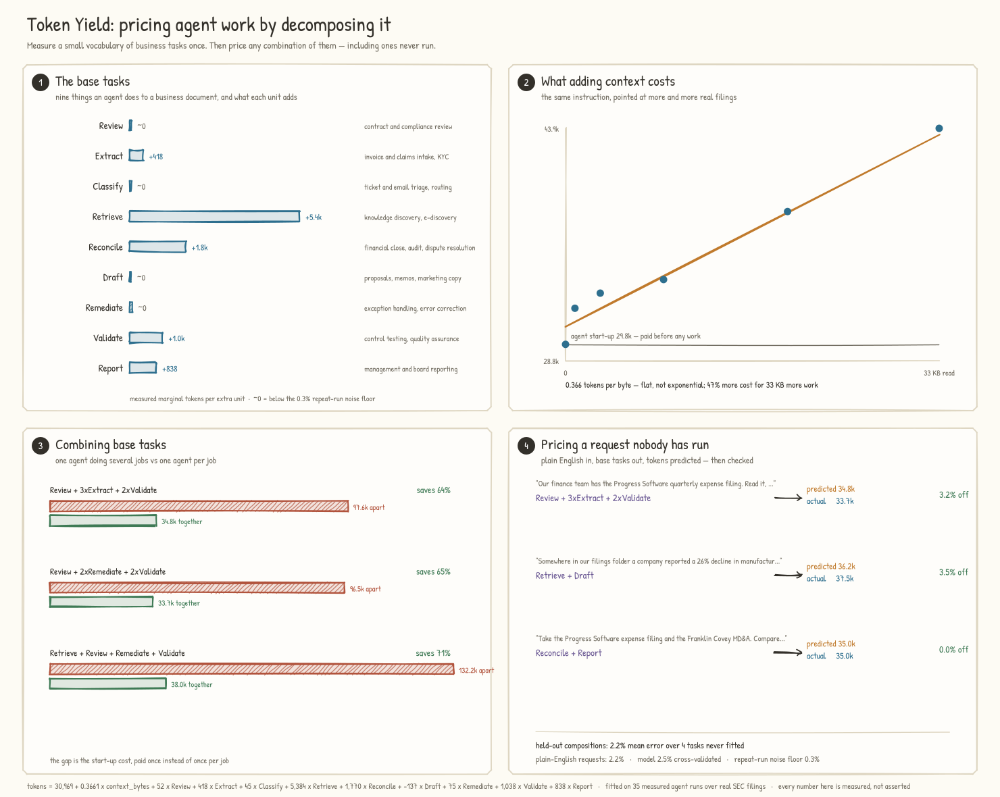

# Composition: naming the work, measuring it, and pricing what was never run

The calibration layer ([calibration-findings.md](calibration-findings.md))
established that agent cost is measurable and that it is dominated by a large
fixed start-up cost. That answers *how much did this run cost*. It does not
answer the question a business actually asks, which is *how much will *this*
cost, before I run it*.

This document records the experiment that closes that gap.



## 1. The problem with "a task"

A cost model needs a unit of work, and "one task" is not a unit — a task can be
anything from renaming a field to closing the quarter. So the first move is to
fix a vocabulary: a small set of **base tasks** that real work decomposes into.

The set here is nine. Each one names a task type enterprises already buy agents
to do, and each maps onto the software-maintenance taxonomy the literature has
used since Swanson (1976) — corrective, adaptive, perfective.

| base task | category | where it is bought |
|---|---|---|
| **Review** | cross-cutting | contract and compliance review |
| **Extract** | cross-cutting | invoice and claims intake, KYC |
| **Classify** | cross-cutting | ticket and email triage, routing |
| **Retrieve** | cross-cutting | knowledge discovery, e-discovery |
| **Reconcile** | corrective | financial close, audit, dispute resolution |
| **Draft** | adaptive | proposals, memos, marketing copy |
| **Remediate** | corrective | exception handling, error correction |
| **Validate** | preventive | control testing, quality assurance |
| **Report** | perfective | management and board reporting |

## 2. What was measured

**39 real agent runs**, every one a fresh memoryless subagent whose
`subagent_tokens` were recorded. The corpus is real: 33 SEC filings and
earnings-call transcripts retrieved from [Bigdata.com](https://bigdata.com),
spanning pharmaceuticals, retail, semiconductors, consumer goods, industrials
and fintech.

The campaign has four tiers ([`token_yield/trainsuite.py`](../token_yield/trainsuite.py)):

| tier | what it is | n |
|---|---|---|
| null | a task that asks for nothing | 2 |
| base | each primitive alone, at more than one size | 22 |
| composite | several primitives in one invocation | 11 |
| held out | compositions excluded from fitting | 4 |

Raw data: [`experiments/train_runs.jsonl`](../experiments/train_runs.jsonl).

## 3. What the measurements said

### 3.1 Most of a task's cost is not the task

The null probe — *reply with the word DONE* — cost **29,821 tokens**. The single
most expensive task in the whole campaign cost 47,240. Starting an agent at all
is 63% of the most expensive thing measured, and 89% of the median one.

Three independent null runs came in at 29,784 / 29,797 / 29,821: a spread of
0.06%. This is not a noisy quantity, it is a fixed toll.

### 3.2 Context is linear, and cheap per byte

The same Review instruction was pointed at growing amounts of real filings:

| context | tokens |
|---|---|
| 0 (null) | 29,821 |
| 861 B | 32,174 |
| 3,179 B | 33,163 |
| 8,973 B | 34,051 |
| 20,315 B | 38,491 |
| 34,190 B | 43,924 |

That is **0.41 tokens per byte**, flat — 33 KB of extra reading adds 47%, not
400%. The fitted coefficient over the whole campaign is 0.366.

This replicates across domains. The identical ladder run against source code
(`psf/requests`, `pallets/click`) gave 0.406 tokens/byte, and the earlier
calibration work gave 0.4174. Three corpora, three domains, same slope to within
12%.

### 3.3 Some base tasks cost nothing to repeat

Fitted marginal cost per extra unit:

| base task | marginal | reading |
|---|---|---|
| Retrieve | 5,384 | searching costs tool calls, and they add up fast |
| Reconcile | 1,770 | reads twice |
| Validate | 1,038 | genuinely produces per unit |
| Report | 838 | genuinely produces per unit |
| Extract | 418 | cheap once the document is open |
| Review, Classify, Draft, Remediate | below noise | free at the margin |

Four of the nine primitives cost less per extra unit than run-to-run noise. Once
an agent has been started and the document is in front of it, asking for a
second correction or a third classification is very nearly free. **Retrieve is
the outlier at 5,384** — an order of magnitude above the others, because it is
the only primitive whose work is searching rather than reading or writing.

That single fact has a direct operational reading: narrow the search space
before you hand work to an agent, and batch everything else.

### 3.4 Composition is not addition

Doing the same Review task **twice** in one invocation cost 34,701 against
34,051 for asking once over the same two documents — an extra 650 tokens, or
1.9%, for a second full pass. The reading is shared; only the answering repeats.

Generalising: the cost of running *n* base tasks in one agent versus *n* agents.

| composition | apart | together | saving |
|---|---|---|---|
| Review + 3xExtract + 2xValidate | 97,646 | 34,804 | **64%** |
| Review + 2xRemediate + 2xValidate | 96,542 | 33,699 | **65%** |
| Retrieve + Review + Remediate + Validate | 132,235 | 37,971 | **71%** |

An additive model cannot see this, and it is the largest single lever a buyer
has. It also points the opposite way to the intuition that mixing task types
costs extra: the earlier calibration work found an *asserted* +15% interaction
surcharge that measurement showed to be a 47% saving. This campaign confirms it
at larger arity, and the saving grows with the number of parts.

## 4. The model

```
tokens = 30,969 + 0.3661 x context_bytes + Σ marginal[p] x units[p]
```

The form is not assumed. Six nested candidates were fitted and scored by
leave-one-out cross-validation, so a richer form only wins if it predicts points
it did not see:

| form | LOO MAPE |
|---|---|
| **bytes + per-primitive** | **2.55%** |
| per-primitive | 3.22% |
| bytes + units | 4.69% |
| bytes | 4.85% |
| units | 5.44% |
| constant | 6.93% |

Note what the selection did to Review. Fitted without a bytes term, Review
looks like it costs 966 tokens a unit. Once `context_bytes` is in the model,
Review's marginal collapses to 52 — because Review's cost was never the
*instruction*, it was the *reading*. The model reassigns it to the right term
without being told to.

Against a **0.29% noise floor**, a 2.55% cross-validated error is roughly 9x the
irreducible limit. More measurement of these same primitives will help less than
reducing run-to-run variance would.

## 5. Pricing what was never run

A vocabulary is only useful if arbitrary requests can be written in it. That is
an autoencoder over tasks:

```
request (free text) --encode--> primitive counts --decode--> tokens
```

The encoder is an agent handed the vocabulary and asked to return counts
([`token_yield/decompose.py`](../token_yield/decompose.py)); the decoder is the
fitted model. Because the round trip ends in a number that can be checked, the
reconstruction error is measurable the moment the task is finally run.

**Held-out compositions** — never used in fitting:

| composition | actual | predicted | error |
|---|---|---|---|
| Review + 2xValidate | 33,174 | 33,549 | 1.1% |
| 2xDraft + Report | 32,878 | 31,986 | 2.7% |
| 6xReview + Draft | 38,732 | 38,583 | 0.4% |
| Retrieve + Review + Remediate + Validate | 36,283 | 37,971 | 4.7% |
| | | **mean** | **2.2%** |

The last row is a four-way mix. The model was fitted on compositions of at most
three distinct primitives, so that arity is genuinely outside its training
range, and it is the worst of the four — which is the right way round.

**Plain-English requests**, written as a person would write them, decomposed by
an agent, priced, and only then run:

| request | decomposed to | predicted | actual | error |
|---|---|---|---|---|
| "read the filing, pull three fields, write two auditor checks" | Review + 3xExtract + 2xValidate | 34,804 | 33,723 | 3.2% |
| "find which company reported the 26% decline, then draft a risk note" | Retrieve + Draft | 36,217 | 37,541 | 3.5% |
| "compare these two filings, then write a board summary" | Reconcile + Report | 34,968 | 34,968 | 0.0% |

The third row is a coincidence, not a bug: the prediction is built only from
fitted coefficients and byte counts, and lands 0.26 tokens from the measured
value. Raw data: [`experiments/decompose_cases.jsonl`](../experiments/decompose_cases.jsonl).

## 6. What this does not show

Being explicit, because the numbers above are more flattering than the method
deserves in places:

- **One model, one size.** Every run used `claude-haiku-4-5`. The start-up
  constant is certainly model-specific; the *shape* of the finding (large fixed
  cost, linear context, sub-additive composition) is what should transfer, not
  the 30,969.
- **Small campaign.** 39 runs, 35 fitted. Enough to select among six forms; not
  enough to claim the marginals are precise to the token.
- **The encoder is not evaluated separately.** Three plain-English cases is a
  demonstration, not an accuracy claim. A wrong decomposition would produce a
  confidently wrong price, and nothing here bounds how often that happens.
- **Documents, not workflows.** Every primitive acts on documents in a folder.
  Real business processes involve systems, approvals and humans waiting, none of
  which is measured.
- **Replicates are thin.** Three primitives have a second run; the rest have
  one. The 0.29% noise floor is computed from those few pairs.

## 7. Reproducing it

```bash
python -m examples.composition_demo        # the whole chain, from committed data
python -m pytest tests/test_compose.py -q  # 39 tests over the vocabulary and model
python docs/media/draw_composition.py      # redraw the figure from the data
```

The figure is generated from `experiments/train_runs.jsonl` and the model fitted
from it, so it cannot drift out of step with the finding it depicts.
